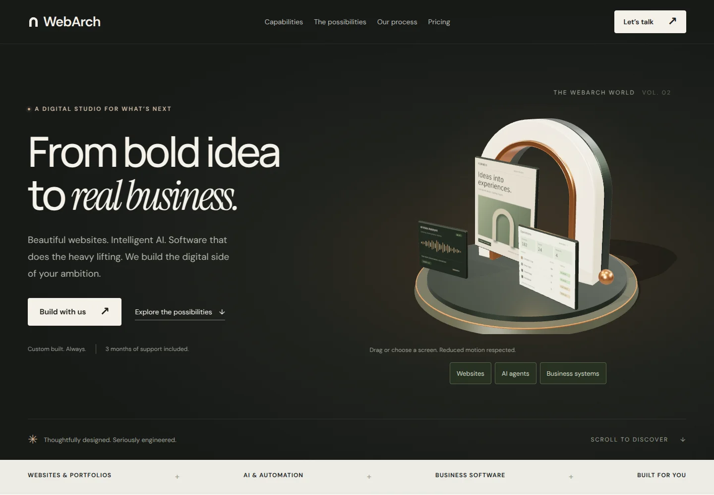

# WebArch 2.0

A responsive digital-studio website built with Vite, vanilla JavaScript and Three.js. The homepage combines a real procedural 3D sculpture with service discovery, interactive product concepts and an enquiry form.

## Develop

Use Node.js 22.12+ (or a compatible current release).

```sh
npm ci
npm run dev
```

```sh
npm run build
npm run preview
```

GitHub Pages deployment is configured for pushes to `main`. The existing `webarch.me` custom domain is retained. Relative asset paths also support repository-subpath hosting.

## Design and behaviour

- Graphite, warm ivory, sage and copper palette with responsive layouts starting at **320px**.
- A procedural arch, metallic trim, product-screen textures, lights and shadows. Mouse movement changes perspective. The pause button stops motion.
- The scene is dynamically imported after essential UI initialization. It pauses outside the viewport and when the tab is hidden. Reduced-motion users get a static render. Browsers without WebGL keep a CSS illustration.
- Six service groups: websites and portfolios; AI systems and agents; agentic workflows; business software; commerce and platforms; data and infrastructure.
- Three keyboard-accessible product-concept tabs, a local workflow simulation and a filterable sample inventory. These are labelled illustrative concepts, not client work or a live AI system.
- Explicit USD/INR controls, with an initial India-time-zone preference and optional browser storage. No IP geolocation requests.
- Properly labelled fields, optional international phone input, service preselection, consent, a honeypot, request timeout, duplicate-submit protection and confirmed-success handling.
- No blocking preloader and no external 3D models or textures. Fonts are bundled locally with system fallbacks, so there are no third-party font requests.

## Editing

| Area                                      | File                 |
| ----------------------------------------- | -------------------- |
| Copy, services, package inclusions, FAQs  | `index.html`         |
| Design system and responsive rules        | `src/style.css`      |
| 3D scene and illustrative screen textures | `src/three/scene.js` |
| Prices and currency preference            | `src/ui/pricing.js`  |
| Mobile menu                               | `src/ui/nav.js`      |
| Product demos                             | `src/ui/demos.js`    |
| Enquiry delivery                          | `src/ui/form.js`     |

Prices preserve the previous JavaScript configuration: Starter $1,500 / ₹14,999; Growth from $3,000 / ₹24,999; support $100 / ₹1,999 per month; feature upgrades $200 / ₹4,999 per session. Custom systems are scoped individually. Package terms and third-party usage fees should be agreed with each client.

The form uses the existing public FormSubmit recipient. Recipient activation and actual email delivery must be verified by the account owner before relying on production enquiries. The automated tests intercept submissions and **never send email**. Failed responses retain the user's fields and offer a direct email link. With JavaScript disabled, the submit button stays disabled and an email fallback is shown.

## Browser checks

```sh
npx playwright install chromium
npm run build
npm test
```

The browser suite covers responsive overflow across a width sweep from 320 to 1920px, all demo panels, mobile navigation, keyboard tabs, currency persistence, service selection, failed/successful form responses, duplicate submits, blocked storage, unavailable WebGL, motion controls and no-JavaScript content. Build and browser checks also run on pull requests.

The Three.js scene is an optional separate bundle (approximately 145KB compressed). Rendering quality is capped on small screens. Test on representative physical phones before tuning visual fidelity upward.

## Preview screenshots

These are screenshots of the implementation, not the earlier generated design concept.

[Desktop preview](docs/desktop-preview.webp) · [320px mobile preview](docs/mobile-320-preview.webp) · [Full homepage](docs/full-page-preview.webp)


